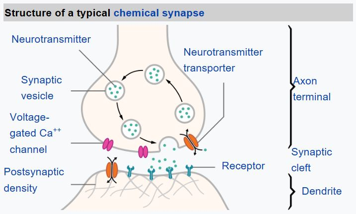

# Introduction to Deep Learning

One of the ways to achieve intelligence is to train a **computer model** or an **artificial brain**. Since the middle of 20th century, researchers tried different mathematical models, until in recent years this direction proved to by hugely successful. Such mathematical models of the brain are called **neural networks**.

> Sometimes neural networks are called Artificial Neural Networks, ANNs, in order to indicate that we are talking about models, not real networks of neurons.

Neural Networks are a part of a larger discipline called Machine Learning, whose goal is to use data to train computer models that are able to solve problems. In Machine Learning, we assume that we have some dataset of examples `X`, and corresponding output values `Y`. Examples are often N-dimensional vectors that consist of `features`, and outputs are called `labels`.

> When representing inputs and outputs as tensors, the input dataset is a matrix of size M×N, where M is number of samples and N is the number of features. Output labels Y is the vector of size M.

From biology we know that our brain consists of neural cells, each of them having multiple "inputs" (axons), and an output (dendrite). Axons and dendrites can conduct electrical signals, and connections between axons and dendrites can exhibit different degrees of conductivity (controlled by neuromediators).

|                       Real Neuron                       |                         Aritificial Neuron                          |
| :-----------------------------------------------------: | :-----------------------------------------------------------------: |
|  |  |

Thus, the simplest mathematical model of a neuron contains several inputs X1, ..., XN and an output Y, and a series of weights W1, ..., WN. An output is calculated as:

$$
Y = f\left(\sum_{i=1}^{N} X_i W_i\right)
$$

where f is some non-linear activation function.

```{note}
Early models of neuron were described in the classical paper A logical calculus of the ideas immanent in nervous activity by Warren McCullock and Walter Pitts in 1943. Donald Hebb in his book "The Organization of Behavior: A Neuropsychological Theory" proposed the way those networks can be trained.
```

## Free Deep Learning Books

1. [Deep Learning by Ian Goodfellow, Yoshua Bengio, and Aaron Courville](https://www.deeplearningbook.org/)
1. [Neural Networks and Deep Learning by Michael Nielsen](http://neuralnetworksanddeeplearning.com/)

## Learn Deep Learning Visually

1. [Neural Networks from Scratch](https://aegeorge42.github.io/)
1. [TensorFlow Playground](https://playground.tensorflow.org/)
1. [A Visual and Interactive Guide to the Basics of Neural Networks](https://jalammar.github.io/visual-interactive-guide-basics-neural-networks/)
1. [Neural Network Seris by 3Blue1Brown](https://www.3blue1brown.com/topics/neural-networks)
1. Back propagation visualization:
   a. [Backprop Explainer](https://xnought.github.io/backprop-explainer/)
   a. [Backpropagation Step by Step](https://hmkcode.com/ai/backpropagation-step-by-step/)
