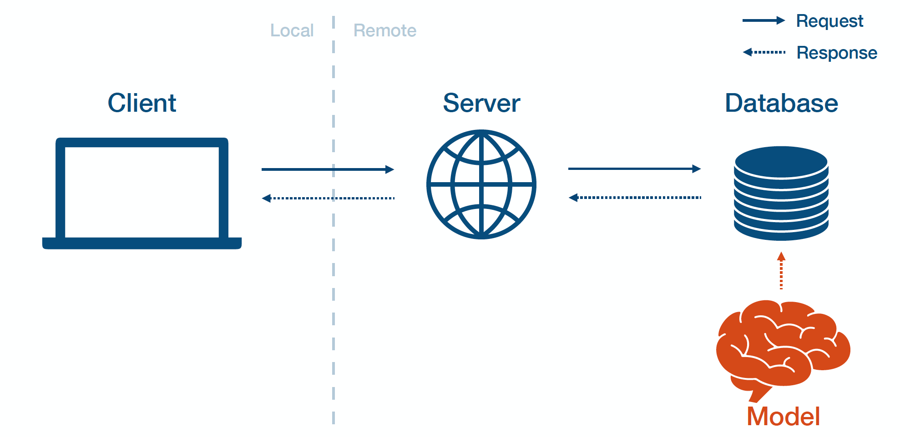
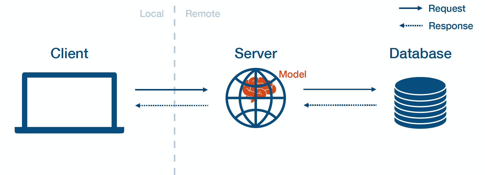
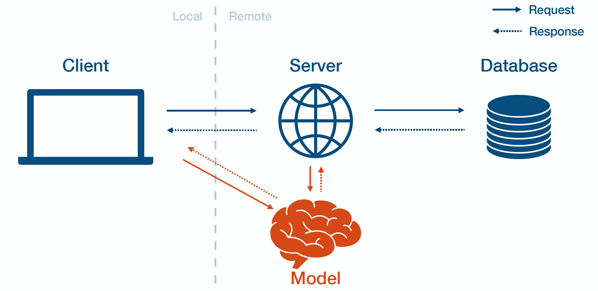

# Deploy ML Apps

## Batch vs Online Prediction

```{figure} ../images/deployment/batch_deployment.png
---
name: batch-prediction
---
Batch prediction. Source: CS 329S: Machine Learning Systems Design (Stanford, 2022)
```

```{figure} ../images/deployment/real_time_deployment.png
---
name: real-time-prediction
---
Online prediction. Source: CS 329S: Machine Learning Systems Design (Stanford, 2022)
```

## Deployment Types

### Batch Prediction



### Model-In-Service



### Model-As-Service



## Examples

Refer to code example in [code/deployment](https://github.com/airlab-unsri/applied-python-training/tree/main/code/deployment) directory.
