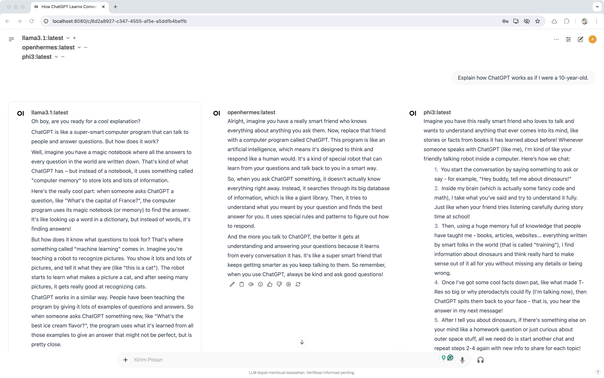

# Setup Local LLMs

1. Download and install Ollama from [here](https://ollama.com/download)
2. Run Ollama:
3. Download large language models by running `ollama pull` command in terminal, for example:
   ```
   ollama pull llama3.1
   ```
4. Run the model
   ```
   ollama run llama3.1
   ```

## Optional: Use Open WebUI

1. Install Open WebUI, from [here](https://docs.openwebui.com/)
2. Run Open WebUI according the installation method you chose above
3. Open the browser and navigate to `http://localhost:8080`


