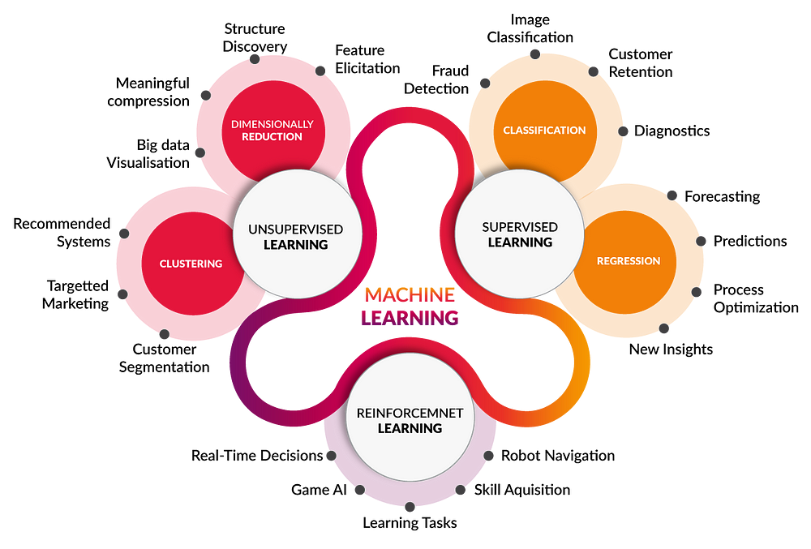

# Introduction to Machine Learning

## What is Machine Learning?

Machine learning (ML) powers some of the most important technologies we use, from translation apps to autonomous vehicles.

ML offers a new way to solve problems, answer complex questions, and create new content. ML can predict the weather, estimate travel times, recommend songs, auto-complete sentences, summarize articles, and generate never-seen-before images.

In basic terms, ML is the process of **training** a piece of software, called a **model**, to make useful **predictions** or generate content from data.

For example, suppose we wanted to create an app to predict rainfall. We could use either a traditional approach or an ML approach. Using a traditional approach, we'd create a physics-based representation of the Earth's atmosphere and surface, computing massive amounts of fluid dynamics equations. This is incredibly difficult.

Using an ML approach, we would give an ML model enormous amounts of weather data until the ML model eventually learned the mathematical relationship between weather patterns that produce differing amounts of rain. We would then give the model the current weather data, and it would predict the amount of rain.

## Types of ML Systems



## ML Life Cycle

```{figure} ../images/ml_lifecycle.png
---
name: ml-lifecycle
---
Machine learning lifecycle. Source: [Merlin: Making ML Model Deployments Magical](https://blog.gojek.io/merlin-making-ml-model-deployments-magical/)
```
