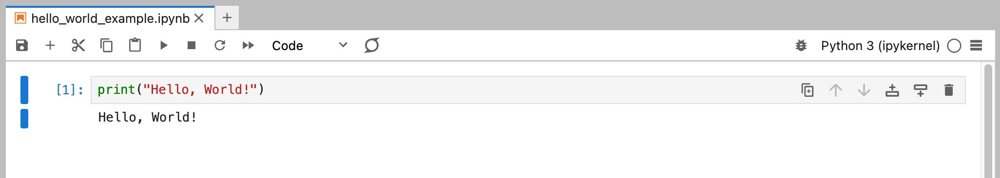

# Hello, World!

Biasanya, ketika seseorang belajar bahasa pemrograman baru, program pertama yang mereka tulis adalah program "Hello, World!". Program ini sangat sederhana dan hanya mencetak pesan "Hello, World!" ke layar.

Untuk menulis program "Hello, World!" di Python, pertama-tama, buat file baru dengan ekstensi `.py` (misalnya, `hello_world.py`) dan tulis kode berikut di dalamnya:

```{code-block} python
print("Hello, World!")
```

Kemudian, jalankan file tersebut menggunakan perintah berikut di terminal:

```{code-block} bash
python hello_world.py
```

Ketika Anda menjalankan perintah tersebut, Anda akan melihat output berikut di terminal:

```{code-block} bash
Hello, World!
```

Selamat! Anda telah menulis dan menjalankan program "Hello, World!" pertama Anda di Python.

Sekarang, mari kita bahas kode di atas:

- `print("Hello, World!")`: Ini adalah pernyataan yang mencetak pesan "Hello, World!" ke layar. Fungsi [`print()`](https://docs.python.org/3/library/functions.html#print) digunakan untuk mencetak pesan ke layar. Pesan yang ingin Anda cetak harus diberikan di dalam tanda kurung. Dalam hal ini, kita memberikan pesan "Hello, World!" di dalam tanda kurung.

---

Selain itu, Anda juga dapat menulis program "Hello, World!" di Python tanpa membuat file terpisah. Anda dapat menggunakan [Python REPL (Read-Eval-Print Loop)](https://docs.python.org/3/tutorial/interpreter.html) untuk menulis dan menjalankan kode Python secara interaktif. Berikut adalah langkah-langkahnya:

1. Buka terminal.
2. Ketik `python` di terminal dan tekan `Enter`. Ini akan membuka Python REPL.
3. Ketik `print("Hello, World!")` di Python REPL dan tekan `Enter`. Anda akan melihat output `Hello, World!` di layar.

---

Opsi lainnya adalah menggunakan [Jupyter Lab](https://jupyter.org/) untuk menulis dan menjalankan kode Python. Jupyter Lab adalah lingkungan komputasi interaktif yang memungkinkan Anda menulis dan menjalankan kode Python dalam sel yang dapat dieksekusi. Anda dapat menginstal Jupyter Lab mengikuti tutorial berikut: [Setup Jupyter Lab](../../getting_started/setup_python/setup_jupyter_lab.md).

Setelah menginstal Jupyter Lab, buka Jupyter Lab dan buat notebook baru. Tulis kode berikut di dalam sel dan jalankan sel tersebut:

```{code-block} python
print("Hello, World!")
```

Anda akan melihat output `Hello, World!` di bawah sel tersebut.


