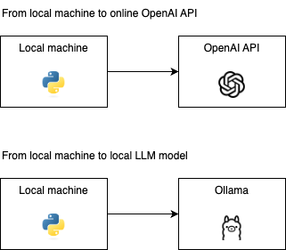

# Integration with OpenAI API



## Local to Online LLM

Prerequisites:

```
pip install openai phidata duckduckgo-search
```

### OpenAI API

Pertama-tama, kamu harus membuat OpenAI API key terlebih dahulu. Kamu bisa mengikuti caranya di sini: https://openrouter.ai/docs/api-keys

Setelah itu, set environment variable OPENAI_API_KEY dengan API key yang kamu dapatkan.

```bash
export OPENAI_API_KEY=***
```

Setelah itu, kamu bisa menggunakan OpenRouter API dengan cara berikut:

```python
from phi.assistant import Assistant
from phi.llm.openai import OpenAIChat
from phi.tools.duckduckgo import DuckDuckGo

assistant = Assistant(
    llm=OpenAIChat(model="gpt-4o", max_tokens=500, temperature=0.3),
    tools=[DuckDuckGo()],
    show_tool_calls=True,
)
assistant.print_response("Whats happening in France?", markdown=True)
```

### OpenRouter.ai

Pertama-tama, kamu harus membuat OpenRouter API key terlebih dahulu. Kamu bisa mengikuti caranya di sini: https://openrouter.ai/docs/api-keys

Setelah itu, set environment variable OPENROUTER_API_KEY dengan API key yang kamu dapatkan.

```bash
export OPENROUTER_API_KEY=***
```

Setelah itu, kamu bisa menggunakan OpenRouter API dengan cara berikut:

```python
from phi.assistant import Assistant
from phi.llm.openrouter import OpenRouter

assistant = Assistant(
    llm=OpenRouter(model="mistralai/mistral-7b-instruct:free"),
    description="You help people with their health and fitness goals.",
)
assistant.print_response("Share a 2 sentence quick and healthy breakfast recipe.", markdown=True)
```

## Local LLMs

Kamu bisa mengikut guide di sini: [Local LLMs](../gen_ai/local_llms)
